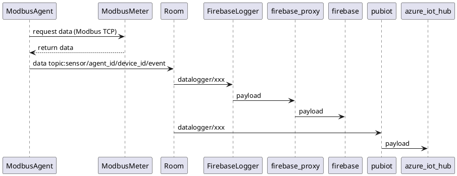
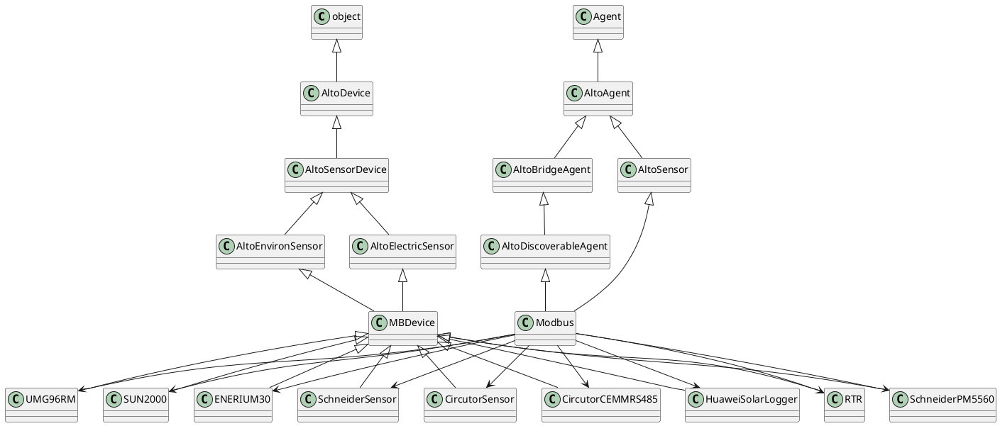

#### Data Flow

```puml
@startuml
participant ModbusAgent as mba
participant ModbusMeter as mm
participant Room as room
participant FirebaseLogger as fbl
participant firebase_proxy as fbp
participant firebase as fb
participant pubiot as piot
participant azure_iot_hub as ahub

mba -> mm : request data (Modbus TCP)
mm --> mba : return data
mba -> room : data topic:sensor/agent_id/device_id/event
room -> fbl : datalogger/xxx
fbl -> fbp : payload
fbp -> fb : payload
room -> piot : datalogger/xxx
piot -> ahub : payload

@enduml

```

#### Class Diagram

```puml
@startuml

object <|-- AltoDevice
AltoDevice <|-- AltoSensorDevice
AltoSensorDevice <|-- AltoEnvironSensor
AltoSensorDevice <|-- AltoElectricSensor
AltoEnvironSensor <|-- MBDevice
AltoElectricSensor <|-- MBDevice
MBDevice <|-- SchneiderSensor
MBDevice <|-- CircutorSensor
MBDevice <|-- CircutorCEMMRS485
MBDevice <|-- HuaweiSolarLogger
MBDevice <|-- RTR
MBDevice <|-- SchneiderPM5560
MBDevice <|-- UMG96RM
MBDevice <|-- SUN2000
MBDevice <|-- ENERIUM30

Agent <|-- AltoAgent
AltoAgent <|-- AltoSensor
AltoAgent <|-- AltoBridgeAgent
AltoBridgeAgent <|-- AltoDiscoverableAgent
AltoSensor <|-- Modbus
AltoDiscoverableAgent <|-- Modbus
Modbus --> SchneiderSensor
Modbus --> CircutorSensor
Modbus --> CircutorCEMMRS485
Modbus --> HuaweiSolarLogger
Modbus --> RTR
Modbus --> SchneiderPM5560
Modbus --> UMG96RM
Modbus --> SUN2000
Modbus --> ENERIUM30

@enduml

```
