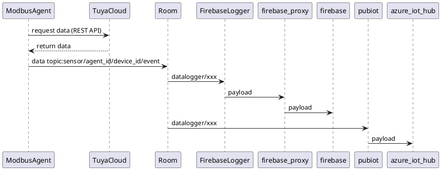
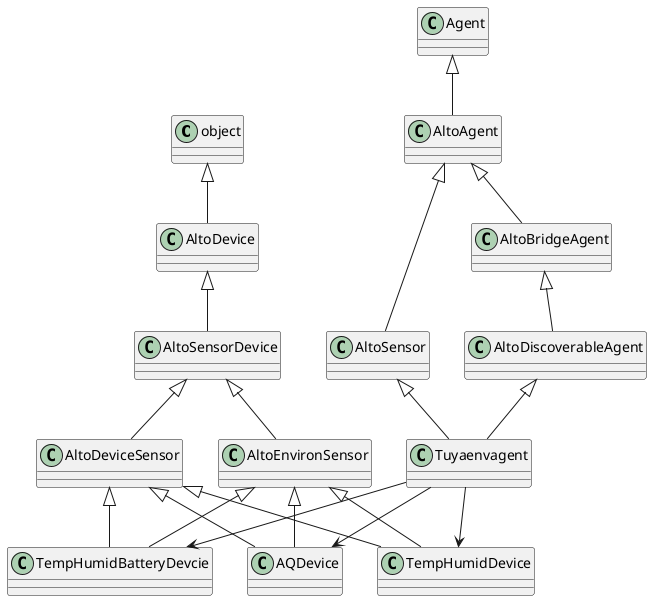

#### Data Flow

```puml
@startuml
participant ModbusAgent as mba
participant TuyaCloud as mm
participant Room as room
participant FirebaseLogger as fbl
participant firebase_proxy as fbp
participant firebase as fb
participant pubiot as piot
participant azure_iot_hub as ahub

mba -> mm : request data (REST API)
mm --> mba : return data
mba -> room : data topic:sensor/agent_id/device_id/event
room -> fbl : datalogger/xxx
fbl -> fbp : payload
fbp -> fb : payload
room -> piot : datalogger/xxx
piot -> ahub : payload

@enduml

```

#### Class Diagram

```puml
@startuml

object <|-- AltoDevice
AltoDevice <|-- AltoSensorDevice
AltoSensorDevice <|-- AltoEnvironSensor
AltoSensorDevice <|-- AltoDeviceSensor
AltoEnvironSensor <|-- TempHumidBatteryDevcie
AltoDeviceSensor <|-- TempHumidBatteryDevcie
AltoEnvironSensor <|-- AQDevice
AltoDeviceSensor <|-- AQDevice
AltoEnvironSensor <|-- TempHumidDevice
AltoDeviceSensor <|-- TempHumidDevice

Agent <|-- AltoAgent
AltoAgent <|-- AltoSensor
AltoAgent <|-- AltoBridgeAgent
AltoBridgeAgent <|-- AltoDiscoverableAgent
AltoSensor <|-- Tuyaenvagent
AltoDiscoverableAgent <|-- Tuyaenvagent
Tuyaenvagent --> TempHumidBatteryDevcie
Tuyaenvagent --> AQDevice
Tuyaenvagent --> TempHumidDevice

@enduml

```
