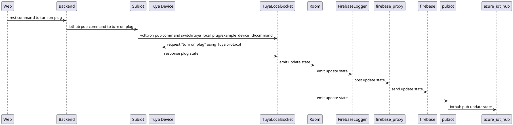
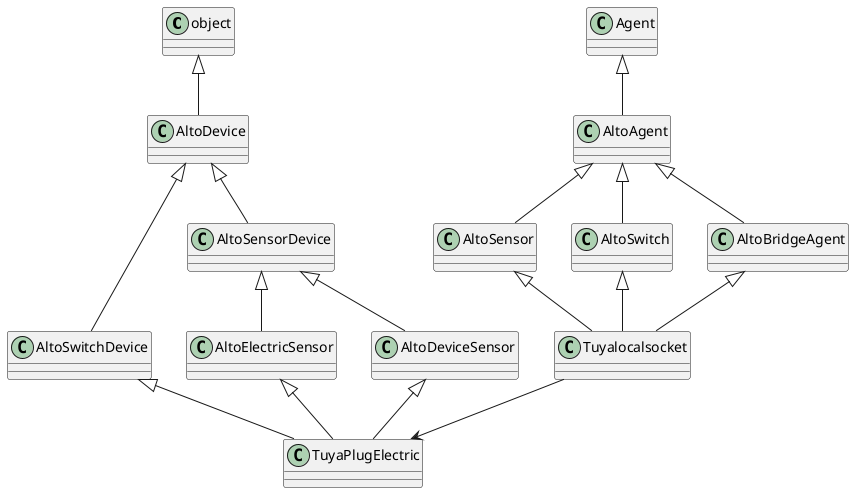

#### Data Flow

```plantuml
@startuml

participant Web as web
participant Backend as be
participant Subiot as siot
participant "Tuya Device" as ad
participant TuyaLocalSocket as da
participant Room as room
participant FirebaseLogger as fbl
participant firebase_proxy as fbp
participant firebase as fb
participant pubiot as piot
participant azure_iot_hub as ahub

web -> be : rest command to turn on plug
be -> siot : iothub pub command to turn on plug 
siot -> da : volttron pub command switch/tuya_local_plug/example_device_id/command
da -> ad : request "turn on plug" using Tuya protocol
ad -> da : response plug state
da -> room : emit update state
room -> fbl : emit update state
fbl -> fbp : post update state
fbp -> fb : send update state
room -> piot : emit update state
piot -> ahub : iothub pub update state

@enduml
```

#### Class Diagram

```plantuml
@startuml

object <|-- AltoDevice
AltoDevice <|-- AltoSwitchDevice
AltoDevice <|-- AltoSensorDevice
AltoSensorDevice <|-- AltoElectricSensor
AltoSensorDevice <|-- AltoDeviceSensor
AltoElectricSensor <|-- TuyaPlugElectric
AltoDeviceSensor <|-- TuyaPlugElectric
AltoSwitchDevice <|-- TuyaPlugElectric

Agent <|-- AltoAgent
AltoAgent <|-- AltoSensor
AltoAgent <|-- AltoSwitch
AltoAgent <|-- AltoBridgeAgent
AltoBridgeAgent <|-- Tuyalocalsocket
AltoSwitch <|-- Tuyalocalsocket
AltoSensor <|-- Tuyalocalsocket
Tuyalocalsocket --> TuyaPlugElectric

@enduml
```
