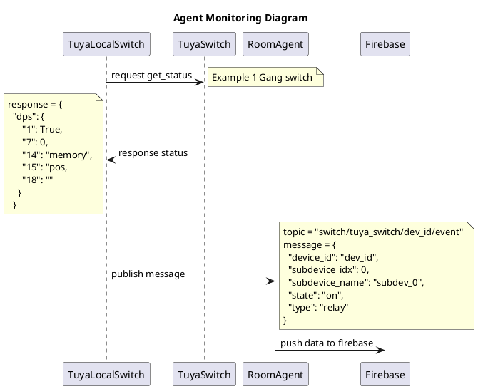
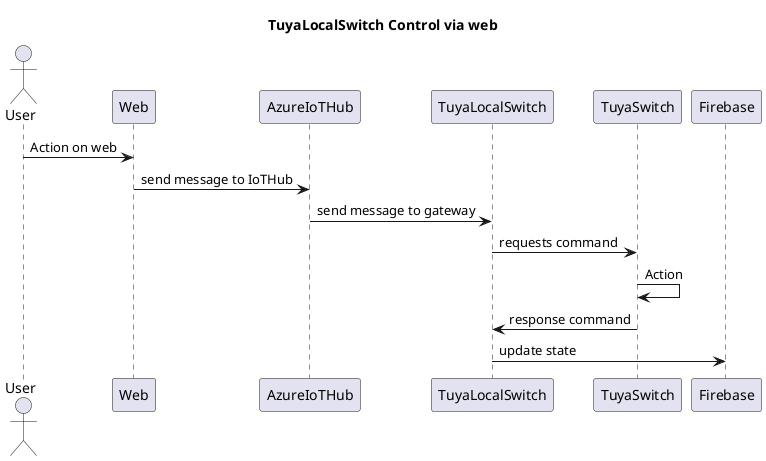
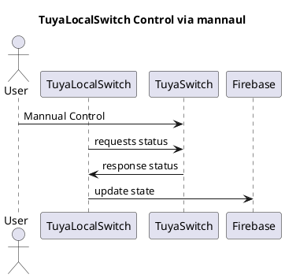

# **TuyaLocalSwitch**
## Description
An agent that monitor and control Tuya Wifi Switch. This Agent use `tinytuya` python library to get state and set command.

# **Config**
key | description | type |
---|---|---|
agent_name | agent identity | string |
topic | prefix topic of the message | string |
sampling_rate | interval rate of getting status | integer |
devices* | device id and prop of device data | dict |

> **Noted*: In devices key of this config contain dict of device_id and list of data of:
- device type
- number of subdevices
- ip_address of device
- local key of device

**Example config**
```JSON
{
    "agent_name": "tuya_switch",
    "topic": "",
    "sampling_rate": 10,
    "devices": {
        "device_id": [
            "tuya_switch",
            1, // number_subdevices
            "ip_address",
            "local_key",
            "device_name"
        ]
    }
}
```

# **Diagram**
## Monitor




## Web Control




## Mannual Control


