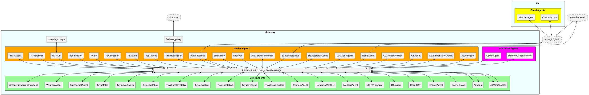
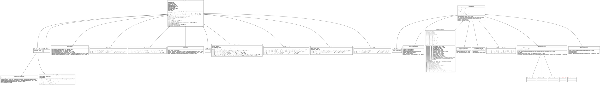

#### Alto OS Agent Overview

```puml
@startuml
skinparam useBetaStyle true
<style>
    .myBus {
        FontColor Blue
    }
</style>

cloud azure_ioT_hub
cloud firebase
cloud altoiotbackend

rectangle "VM" #azure {

  rectangle "Cloud Agents" #yellow {
      agent CustomAction
      agent WatcherAgent
  }
  
}

rectangle "Gateway" #azure {
    
    rectangle firebase_proxy
    rectangle cratedb_storage

    rectangle "Service Agents" #orange {
        agent ActionAgent
        agent ActionTranslatorAgent
        agent ApiAgent
        agent CO2NobodyAction
        agent CrateDB
        agent DataAggregator
        agent DeviceStatusCount
        agent FirebaseLogger
        agent InitialStateForwarder
        agent LifeCycle
        agent LineNotify
        agent NotifyAgent
        agent PublishIoThub
        agent RESTAgent
        agent RLAction
        agent RLCorrection
        agent Room
        agent RoomAction
        agent SubscribeIoThub
        agent Transformer
        agent TrivialAgent
    }
    
    queue message_bus as "                                                                                                                                                         Information Exchange Bus (Zero MQ)                                                                                                                                                         "
    
    rectangle "Device Agents" #palegreen {
        agent ACWiFiAdapter
        agent Airveda
        agent BACnetHVAC
        agent ChargeAgent
        agent DepaREST
        agent ITMAgent
        agent MQTTNiangara
        agent ModbusAgent
        agent NetatmoWeather
        agent TasmotaAgent
        agent TuyaCloudCurtain
        agent TuyaEnvAgent
        agent TuyaLocalBlind
        agent TuyaLocalEnv
        agent TuyaLocalEnvRelay
        agent TuyaLocalPlug
        agent TuyaLocalSwitch
        agent TuyaMeter
        agent TuyaSocketAgent
        agent WeatherAgent
        agent airconetservercontrolAgent
    }
    
    rectangle "Platforms Agents" #magenta {
        agent MemoryUsageMonitor
        agent OSWifiAgent
    }
    
}

WatcherAgent <--> azure_ioT_hub
CustomAction <--> azure_ioT_hub
altoiotbackend --> azure_ioT_hub

PublishIoThub <--> message_bus
ActionAgent <--> message_bus
ActionTranslatorAgent <--> message_bus
ApiAgent <--> message_bus
CO2NobodyAction <--> message_bus
CrateDB <--> message_bus
DataAggregator <--> message_bus
DeviceStatusCount <--> message_bus
FirebaseLogger <--> message_bus
InitialStateForwarder <--> message_bus
LifeCycle <--> message_bus
LineNotify <--> message_bus
NotifyAgent <--> message_bus
PublishIoThub <--> message_bus
RESTAgent <--> message_bus
RLAction <--> message_bus
RLCorrection <--> message_bus
Room <--> message_bus
RoomAction <--> message_bus
SubscribeIoThub <--> message_bus
Transformer <--> message_bus
TrivialAgent <--> message_bus

message_bus <--> ACWiFiAdapter
message_bus <--> Airveda
message_bus <--> ACWiFiAdapter
message_bus <--> Airveda
message_bus <--> BACnetHVAC
message_bus <--> ChargeAgent
message_bus <--> DepaREST
message_bus <--> ITMAgent
message_bus <--> MQTTNiangara
message_bus <--> ModbusAgent
message_bus <--> NetatmoWeather
message_bus <--> TasmotaAgent
message_bus <--> TuyaCloudCurtain
message_bus <--> TuyaEnvAgent
message_bus <--> TuyaLocalBlind
message_bus <--> TuyaLocalEnv
message_bus <--> TuyaLocalEnvRelay
message_bus <--> TuyaLocalPlug
message_bus <--> TuyaLocalSwitch
message_bus <--> TuyaMeter
message_bus <--> TuyaSocketAgent
message_bus <--> WeatherAgent
message_bus <--> airconetservercontrolAgent

MemoryUsageMonitor <--> message_bus
OSWifiAgent <--> message_bus

cratedb_storage <--> CrateDB
firebase_proxy <--> FirebaseLogger
firebase <-- firebase_proxy
azure_ioT_hub <-- PublishIoThub
azure_ioT_hub --> SubscribeIoThub
altoiotbackend <-- NotifyAgent

@enduml

```

#### Alto LIB, Class Diagram

```puml
@startdot
digraph "classes" {
rankdir=BT
charset="utf-8"
"altolib.altolib.AltoAgent" [color="black", fontcolor="black", label="{AltoAgent|agent_name\lcurrent_config\ldevice_list : dict\lheartbeat_rate : int\lheartbeat_status : str\lis_bridge : bool\llog_commands : bool\lschemas : set\ltopic : str\l|announce_new_device(dev: AltoDevice)\lbuild_devices()\lconfigure(config_name: str, action: str, contents: Mapping[str, Any]): None\lhandle_request_config(topic: List[str], message: Mapping[str, Any]): None\llast_rites()\lpublish(topic: str, value: Any, mtype: str): None\lregister_new_device(dev: AltoDevice)\lregister_self()\lrip(sender)\lsave_config(name: str): None\lsend_heartbeat(): None\lsend_response_devinfo(devid: str, message: List[Any]): None\lset_attr_types(): None\lset_heartbeat_status(msg: str): None\lunregister_device(devid)\l}", shape="record", style="solid"];
"altolib.altolib.AltoBattery" [color="black", fontcolor="black", label="{AltoBattery|name_subdevices\l|}", shape="record", style="solid"];
"altolib.altolib.AltoBridgeAgent" [color="black", fontcolor="black", label="{AltoBridgeAgent|is_bridge : bool\l|}", shape="record", style="solid"];
"altolib.altolib.AltoButton" [color="black", fontcolor="black", label="{AltoButton|\l|}", shape="record", style="solid"];
"altolib.altolib.AltoCharger" [color="black", fontcolor="black", label="{AltoCharger|\l|emit_event_charging(devid: str, payload: Any)\lemit_event_eject(devid: str, payload: Any)\lemit_event_load(devid: str, payload: Any): None\lemit_event_online(devid: str, payload: Any): None\lhandle_command_charger(topic: List[str], message: Mapping[str, Any]): None\lhandle_request_charger(topic: List[str], message: Mapping[str, Any]): None\l}", shape="record", style="solid"];
"altolib.altolib.AltoCurtain" [color="black", fontcolor="black", label="{AltoCurtain|\l|emit_event_motor(dev: AltoCurtainDevice): None\lhandle_command_curtain(topic: List[str], message: Mapping[str, Any]): None\lhandle_request_curtain(topic: List[str], message: Mapping[str, Any]): None\l}", shape="record", style="solid"];
"altolib.altolib.AltoCurtainDevice" [color="black", fontcolor="black", label="{AltoCurtainDevice|is_state_updated\l|close_curtain(subdev)\lopen_curtain(subdev)\lset_percent_position(subdev, position)\lstatus_data(subdevice_idx)\lstop_curtain(subdev)\lupdate_control_state(subdevice_idx, value)\l}", shape="record", style="solid"];
"altolib.altolib.AltoDatalogger" [color="black", fontcolor="black", label="{AltoDatalogger|\l|handle_event_datalogger(topic: List[str], message: Mapping[str, Any]): None\lhandle_query_request(devid, message)\lhandle_request_datalogger(topic: List[str], message: Mapping[str, Any]): None\l}", shape="record", style="solid"];
"altolib.altolib.AltoDevice" [color="black", fontcolor="black", label="{AltoDevice|controller\lcurrent_state : dict\ldevice_id : str\linfo : dict\lis_online : bool\lname_subdevices\lnumber_subdevices : int\lschema_supported\l|online_status(value: bool): None\lset_subdevice_name(subdevice_idx: int, name: str): bool\lsubdevice_name_to_idx(name: Union[str, int]): int\lupdate_device(device)\lupdate_info(key, value)\l}", shape="record", style="solid"];
"altolib.altolib.AltoDeviceSensor" [color="black", fontcolor="black", label="{AltoDeviceSensor|\l|}", shape="record", style="solid"];
"altolib.altolib.AltoDiscoverableAgent" [color="black", fontcolor="black", label="{AltoDiscoverableAgent|discovery_rate : int\l|configure(config_name: str, action: str, contents: Mapping[str, Any]): None\lhandle_request_discovery(topic: List[str], message: Mapping[str, Any]): None\lsend_response_discovery(message: List[Any]): None\lstart_discovery(): None\l}", shape="record", style="solid"];
"altolib.altolib.AltoElectricSensor" [color="black", fontcolor="black", label="{AltoElectricSensor|\l|}", shape="record", style="solid"];
"altolib.altolib.AltoEnvironSensor" [color="black", fontcolor="black", label="{AltoEnvironSensor|\l|}", shape="record", style="solid"];
"altolib.altolib.AltoHVAC" [color="black", fontcolor="black", label="{AltoHVAC|\l|emit_event_state(devid)\lhandle_command_hvac(topic: List[str], message: Mapping[str, Any]): None\lhandle_request_hvac(topic: List[str], message: Mapping[str, Any]): None\lsend_response_devinfo(devid: str, message: List[Any]): None\l}", shape="record", style="solid"];
"altolib.altolib.AltoHVACDevice" [color="black", fontcolor="black", label="{AltoHVACDevice|capabilities : dict\lcurrent_hvac_state\lcurrent_state_alarm\lcurrent_state_economy\lcurrent_state_fan\lcurrent_state_flow\lcurrent_state_horizontal_flow\lcurrent_state_lock\lcurrent_state_mode\lcurrent_state_purifier\lcurrent_state_read_lock\lcurrent_state_room_temperature\lcurrent_state_set_temperature\lcurrent_state_source\lupdate_on_set : bool\l|command_set_alarm(value: dict): None\lcommand_set_economy(value: str): None\lcommand_set_fan(value: str): None\lcommand_set_filter(mode: str): None\lcommand_set_flow(value: str): None\lcommand_set_horizontal_flow(value: str): None\lcommand_set_lock(value: dict): None\lcommand_set_louver(mode: str): None\lcommand_set_mode(mode: str): None\lcommand_set_purifier(value: str): None\lcommand_set_read_lock(value: list): None\lcommand_set_set_temperature(temp: Union[int, float]): None\lcommand_set_temperature(temp: Union[int, float]): None\lcommand_was_sent()\lstatus_data()\lto_schema(prop: str, value: Any): Union[str, int, float]\lupdate_alarm(value: dict): bool\lupdate_fan(value: str): bool\lupdate_flow(value: str): bool\lupdate_horizontal_flow(value: str): bool\lupdate_lock(value: dict): bool\lupdate_mode(mode: str): bool\lupdate_purifier(value: str): bool\lupdate_read_lock(value: list): bool\lupdate_room_temperature(value: Union[int, float]): bool\lupdate_set_temperature(value: Union[int, float]): bool\l}", shape="record", style="solid"];
"altolib.altolib.AltoLight" [color="black", fontcolor="black", label="{AltoLight|\l|}", shape="record", style="solid"];
"altolib.altolib.AltoLocation" [color="black", fontcolor="black", label="{AltoLocation|parent_location\lto_be_added : dict\l|add_device(schema: str, agent: str, device_id: str): bool\ldel_device(device_id)\lhandle_command_location(topic: List[str], message: Mapping[str, Any]): None\lhandle_device_message(peer, sender, bus, topic, headers, message)\lhandle_event_location(topic: List[str], message: Mapping[str, Any]): None\lhandle_request_location(topic: List[str], message: Mapping[str, Any]): None\lhandle_response_location(topic: List[str], message: Mapping[str, Any], headers: Mapping[str, Any]): None\lname_device(name: str, schema: str, agent: str, device_id: str, subdevice_idx: Union[int, str]): bool\l}", shape="record", style="solid"];
"altolib.altolib.AltoLocationDevice" [color="black", fontcolor="black", label="{AltoLocationDevice|occupation : int\l|add_occupant(nb: int): None\ldel_occupant(nb: int): None\l}", shape="record", style="solid"];
"altolib.altolib.AltoLoggerDevice" [color="black", fontcolor="black", label="{AltoLoggerDevice|datatype : Optional[list]\l|flush_data()\llog_data(data: dict): None\l}", shape="record", style="solid"];
"altolib.altolib.AltoMQTTAgent" [color="black", fontcolor="black", label="{AltoMQTTAgent|mqtt_client : NoneType\lmqtt_prefix\l|configure(config_name: str, action: str, contents: Mapping[str, Any]): None\lmqttstart(sender: str): None\lmqttstop(sender: str): None\lon_mqtt_connect(client, myself, flags, rc)\lprocess_mqtt_message(client, msg)\lsend_mqtt_message(topic, payload)\l}", shape="record", style="solid"];
"altolib.altolib.AltoNotImpl" [color="black", fontcolor="red", label="{AltoNotImpl|\l|}", shape="record", style="solid"];
"altolib.altolib.AltoRemoteC" [color="black", fontcolor="black", label="{AltoRemoteC|\l|emit_event_learnt(dev: AltoRemoteCDevice, subdevice_idx: int, cid: str, code: bytearray): None\lemit_event_next(dev: AltoRemoteCDevice, subdevice_idx: int, cid: str): None\lemit_event_sent(dev: AltoRemoteCDevice, subdevice_idx: int, cid: str, result: bool): None\lhandle_command_remotec(topic: List[str], message: Mapping[str, Any]): None\lhandle_request_remotec(topic: List[str], message: Mapping[str, Any]): None\l}", shape="record", style="solid"];
"altolib.altolib.AltoRemoteCDevice" [color="black", fontcolor="black", label="{AltoRemoteCDevice|\l|command_learn_code_ir(message: Mapping[str, Any]): None\lcommand_learn_code_rf(message: Mapping[str, Any]): None\lcommand_send_code(code: List[int], is_raw: bool): None\l}", shape="record", style="solid"];
"altolib.altolib.AltoSchemaError" [color="black", fontcolor="red", label="{AltoSchemaError|\l|}", shape="record", style="solid"];
"altolib.altolib.AltoSensor" [color="black", fontcolor="black", label="{AltoSensor|auto_send : bool\lsampling_rate : int\l|emit_event_sample(dev: AltoSensorDevice, subdev: int, data: Mapping[str, Any]): None\lhandle_command_sensor(topic: List[str], message: Mapping[str, Any]): None\lhandle_request_sensor(topic: List[str], message: Mapping[str, Any]): None\lsend_samples(): None\l}", shape="record", style="solid"];
"altolib.altolib.AltoSensorDevice" [color="black", fontcolor="black", label="{AltoSensorDevice|data_map : dict\ldatapoint_supported : dict\lsensor_type_supported\l|event_sensor_sample(subdevice_idx: int, sensor_type: str, datapoint: str): None\lget_data()\linitialise_data(sensor_type: str, datapoints: List[str]): None\lset_sensor_data(data: Mapping[str, Any], subdevice: Union[str, int], sensor_type: Optional[str]): List[str]\l}", shape="record", style="solid"];
"altolib.altolib.AltoSwitch" [color="black", fontcolor="black", label="{AltoSwitch|\l|emit_event_relay(dev: AltoSwitchDevice, subdevice_idx: int, state: str): None\lhandle_command_switch(topic: List[str], message: Mapping[str, Any]): None\lhandle_request_switch(topic: List[str], message: Mapping[str, Any]): None\l}", shape="record", style="solid"];
"altolib.altolib.AltoSwitchDevice" [color="black", fontcolor="black", label="{AltoSwitchDevice|\l|event_switch_state_change(subdevice_idx: int): None\lturn_off(subdev)\lturn_on(subdev)\lupdate_switch_state(subdevice: Union[int, str], state: str): None\l}", shape="record", style="solid"];
"altolib.altolib.AltoBattery" -> "altolib.altolib.AltoDevice" [arrowhead="empty", arrowtail="none"];
"altolib.altolib.AltoBridgeAgent" -> "altolib.altolib.AltoAgent" [arrowhead="empty", arrowtail="none"];
"altolib.altolib.AltoButton" -> "altolib.altolib.AltoAgent" [arrowhead="empty", arrowtail="none"];
"altolib.altolib.AltoCharger" -> "altolib.altolib.AltoAgent" [arrowhead="empty", arrowtail="none"];
"altolib.altolib.AltoCurtain" -> "altolib.altolib.AltoAgent" [arrowhead="empty", arrowtail="none"];
"altolib.altolib.AltoCurtainDevice" -> "altolib.altolib.AltoDevice" [arrowhead="empty", arrowtail="none"];
"altolib.altolib.AltoDatalogger" -> "altolib.altolib.AltoAgent" [arrowhead="empty", arrowtail="none"];
"altolib.altolib.AltoDeviceSensor" -> "altolib.altolib.AltoSensorDevice" [arrowhead="empty", arrowtail="none"];
"altolib.altolib.AltoDiscoverableAgent" -> "altolib.altolib.AltoBridgeAgent" [arrowhead="empty", arrowtail="none"];
"altolib.altolib.AltoElectricSensor" -> "altolib.altolib.AltoSensorDevice" [arrowhead="empty", arrowtail="none"];
"altolib.altolib.AltoEnvironSensor" -> "altolib.altolib.AltoSensorDevice" [arrowhead="empty", arrowtail="none"];
"altolib.altolib.AltoHVAC" -> "altolib.altolib.AltoAgent" [arrowhead="empty", arrowtail="none"];
"altolib.altolib.AltoHVACDevice" -> "altolib.altolib.AltoDevice" [arrowhead="empty", arrowtail="none"];
"altolib.altolib.AltoLight" -> "altolib.altolib.AltoAgent" [arrowhead="empty", arrowtail="none"];
"altolib.altolib.AltoLocation" -> "altolib.altolib.AltoAgent" [arrowhead="empty", arrowtail="none"];
"altolib.altolib.AltoLocationDevice" -> "altolib.altolib.AltoDevice" [arrowhead="empty", arrowtail="none"];
"altolib.altolib.AltoLoggerDevice" -> "altolib.altolib.AltoDevice" [arrowhead="empty", arrowtail="none"];
"altolib.altolib.AltoMQTTAgent" -> "altolib.altolib.AltoBridgeAgent" [arrowhead="empty", arrowtail="none"];
"altolib.altolib.AltoRemoteC" -> "altolib.altolib.AltoAgent" [arrowhead="empty", arrowtail="none"];
"altolib.altolib.AltoRemoteCDevice" -> "altolib.altolib.AltoDevice" [arrowhead="empty", arrowtail="none"];
"altolib.altolib.AltoSensor" -> "altolib.altolib.AltoAgent" [arrowhead="empty", arrowtail="none"];
"altolib.altolib.AltoSensorDevice" -> "altolib.altolib.AltoDevice" [arrowhead="empty", arrowtail="none"];
"altolib.altolib.AltoSwitch" -> "altolib.altolib.AltoAgent" [arrowhead="empty", arrowtail="none"];
"altolib.altolib.AltoSwitchDevice" -> "altolib.altolib.AltoDevice" [arrowhead="empty", arrowtail="none"];
}

@enddot
```

