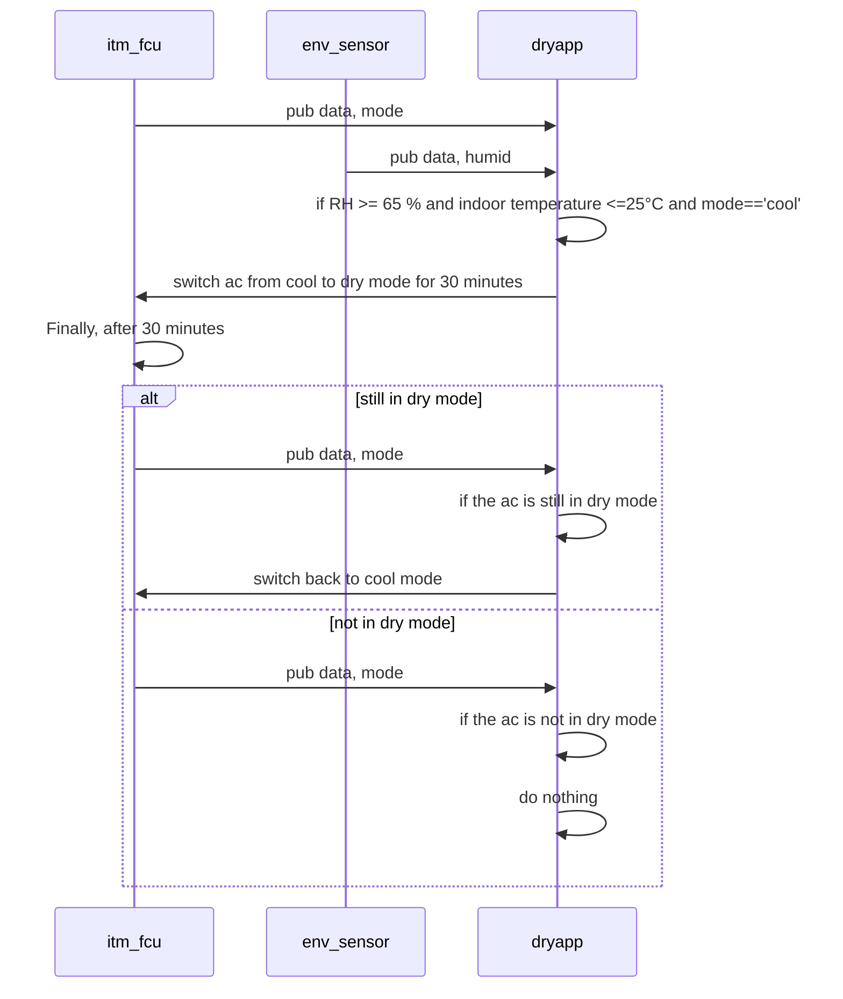

#### Flows

```mermaid
sequenceDiagram

participant hvac as itm_fcu
participant es as env_sensor
participant dryapp

hvac ->> dryapp : pub data, mode
es ->> dryapp : pub data, humid
dryapp ->> dryapp : if RH >= 65 % and indoor temperature <=25°C and mode=='cool'
dryapp ->> hvac : switch ac from cool to dry mode for 30 minutes
hvac ->> hvac : Finally, after 30 minutes
alt still in dry mode
hvac ->> dryapp : pub data, mode
dryapp ->> dryapp : if the ac is still in dry mode
dryapp ->> hvac : switch back to cool mode
else not in dry mode
hvac ->> dryapp : pub data, mode
dryapp ->> dryapp : if the ac is not in dry mode
dryapp ->> dryapp : do nothing
end
```
